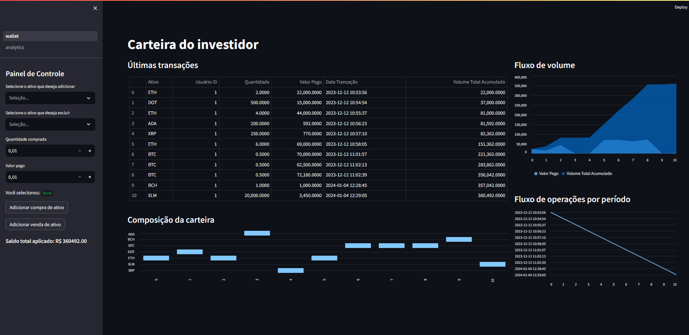

### Este aplicativo de banco de dados oferece aos usuários a capacidade de gerenciar seus ativos financeiros de maneira personalizada, permitindo a adição e exclusão de ativos. Além disso, proporciona uma análise detalhada do desempenho desses ativos por meio de gráficos intuitivos, possibilitando uma compreensão visual e eficiente da evolução de seus investimentos ao longo do tempo.

Prévia em construção

